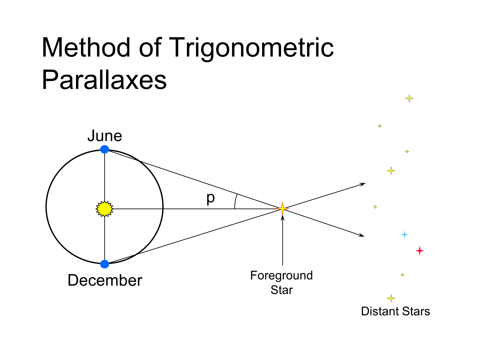

# 12 Kinetic Theory and Brownian Motion

In microscopic view, gas molecules are studied statistically.   
Motions of molecules are investigated.

Robert Brown studied on the motion of gas molecules.  
He discovered that the motion of gas molecules are **random** in nature and it is of **zig-zag path**.

